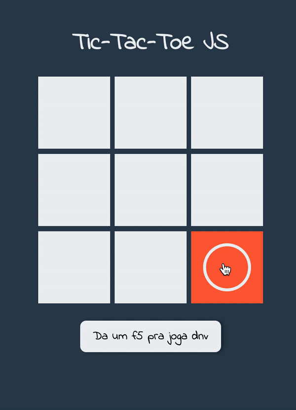

# Criando um Tic Tac Toe com JS 

# Introdução 

Com a quarentena a gente vai ganhando um tempo ocioso, pensando nisso crie esse rápido projeto de Tic Tac Toe (joga da velha) e vou compartilhar um pouco a forma como escrevi o código dele. 

# HTML e CSS 

Para fazer o layout usei somente elementos simples de HTML, criei uma ``<div />`` para segurar as linhas do TTT e três ``<div />`` para segurar as linhas do TTT, cada linha tem três ``<button />`` e são neles que a magia acontece. Usando FlexBox alinhei todos os elementos no centro, tanto verticalmente quando horizontalmente. 

Com **CSS** criei algumas ``.classes{}`` que fazem todo o trabalho do ``:hover{}`` e ``.selected`` assim não preciso de muito Javascript (já vamos chegar no JS). Usando o seletor ``:after{}`` e ``:before{}`` consegui criar os elementos de **bolinha** e o **xis** assim não preciso utilizar ```` em momento algum. 

## Javascript

Analisei em alguns projetos de TTT na web antes de começar o meu, e uma coisa que me deixou incomodado foi a forma como o pessoal fazer a validação se tinha um vencedor, tinham muitos **IF/ ELSE IF/ ELSE**, tentei minimizar um pouco o código. 

No inicio do JS criei dois ``for()`` para percorrer as linhas e colunas da ``<div />`` principal e adicionando **eventListener**:

### eventListener de click

Cada botão recebe um ``eventListener`` de click, quando um usuário clicar esse event vai ser disparado executando uma função que vai: 
  - Primeiro: Verificar se aquele ``<button />`` não tem uma classe de ``.active``. Pq? Pq o usuário n pode clicar duas vezes no mesmo ``<button />
  - Segundo: Se não tiver a classe ``.active`` ele vai adicionar uma class ``.active`` naquele ``<button />`` e mudar o **turn** ( da a vez para o colequinha jogar) e adiciona uma jogada no contador ``numberCheck`` 
  - Terceiro: Se o número de ``numberCheck`` for maior ou igual a **5** ele começa a verificar se já teve um vencendor chamando a função ``HaveWinner()``.

### eventListener de mouseenter e mouseleave

Esse eventos ajudam o CSS a deixar o jogo mais amigavel, quando for a vez do jogador **xis** ele vai adicionar uma classe em todos os ``<button />`` assim que o usuário passar o mouse por cima (sim ``:hover{}``) o CSS vai adicionar temporariamente a figura do **xis**. E se o usuário passar o mouse em outro ``<button />`` o JS vai remover a classe do ``<button />`` anterior, afinal de contas ele não vai mais precisar ver o **xis** no q ele não vai selecionar. 

Após adicionar alguns eventListener crio algumas funções que são responsavel por verificar se tem ganhador e voltar o jogo do zero. 

### HaveWinner()

Aqui ta um ponto que eu tentei simplificar ao máximo pra reaproveitar código. Criei uma função que percorre as linhas e colunas para saber se todos os elementos delas tem a mesma ``.classes`` CSS, além disso a função recebe as posições dos botões, então eu consigo verificar as diagonais de uma forma fácil, bastar passar o **ID** delas. 

### check()

Função que recebe os elementos q ela tem q verificar, como parâmetro vai receber o primeiro, segundo e o terceiro elemento para a validação. Verifico se o primeiro tem a classe ``.active``, se tiver verifico se o segundo e terceiro tem a classe igual o primeiro [``.xis`` or ``.circle``] se tiver tudo igual significa q alguém ganhou, nesse ponto eu desabilito todos os ``<button />`` para o seu colega não tentar da um de esperto e falar q foi ele q ganhou!

### reset()

Essa função serve pra vc jogar dnv e tentar ganhar do seu coleguinha. Ela simplismente volta o jogo do 0 #BoaSorte


# Resultado final

